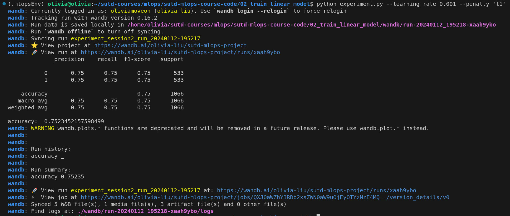

## Session 2: Train linear classifier

Step 1: install all the dependencies described in requirements.txt

> pip -r requirements.txt 

Step 2: run the experiment.py script

> python experiment.py --learning_rate 0.001 --penalty 'l1' --loss "log_loss"
There are 3 parameters which you can specify:
- learning_rate
- penalty
- loss

Step 3: Examine the logs file in wandb with the provided link:
