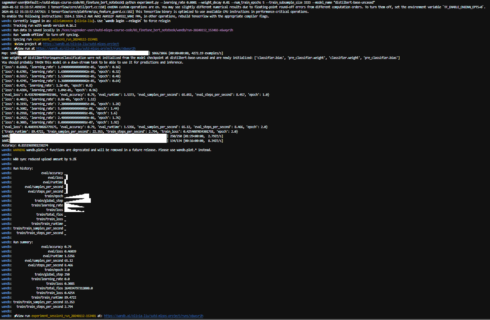

## Session 2: Train linear classifier

**Step 1**: install all the dependencies described in requirements.txt

> pip -r requirements.txt 

**Step 2**: run the experiment.py script

> python experiment.py --learning_rate 0.0001 --weight_decay 0.01 --num_train_epochs 5 --train_subsample_size 3333 --model_name "distilbert-base-uncased"
There are 5 parameters which you can specify:
- learning_rate
- weight_decay
- num_train_epochs
- train_subsample_size
- model_name

**Step 3:** Examine the logs file in wandb with the provided link:
